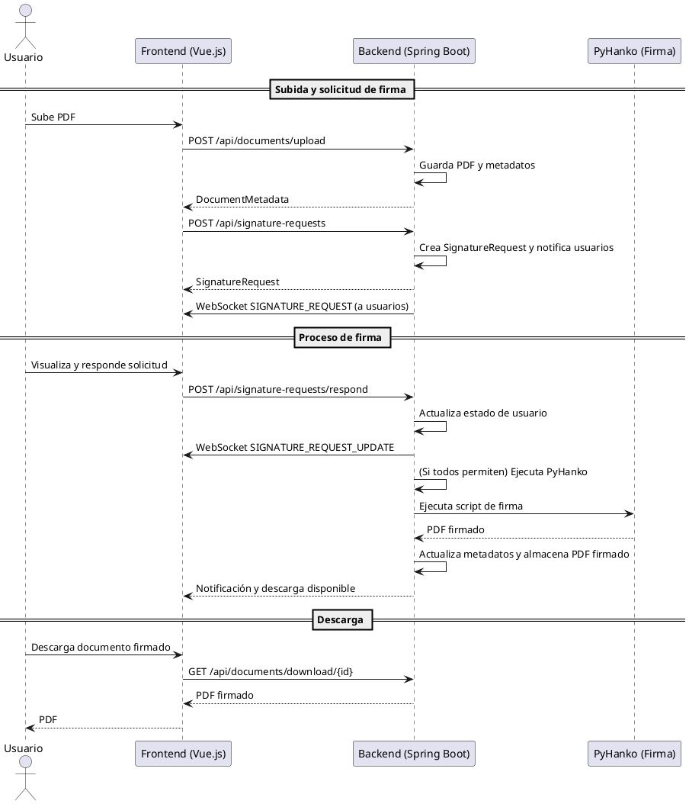

# Electronic Signature - README


## Diagrama de Secuencia (Flujo Principal)




**Electronic Signature** es una plataforma web para la gestión, firma electrónica y flujo de aprobación de documentos PDF. Permite a los usuarios subir documentos, solicitar firmas a otros usuarios, firmar digitalmente con certificados, y recibir notificaciones en tiempo real mediante WebSockets.

El sistema está compuesto por:
- **Frontend**: SPA en Vue.js + TailwindCSS
- **Backend**: Java Spring Boot, integración con MongoDB y base de datos relacional (JPA/Hibernate)
- **Firmado**: Integración con PyHanko (Python) para la firma digital de PDFs
- **WebSockets**: Notificaciones y solicitudes de firma en tiempo real

---

## Estructura de Carpetas


```
Electronic-Signature/
├── despliegue/                      # Archivos de despliegue y configuración
│   ├── docker-compose.yml           # Stack completo (backend, frontend, MongoDB, nginx)
│   ├── Dockerfile.backend           # Dockerfile para el backend
│   ├── Dockerfile.frontend          # Dockerfile para el frontend
│   ├── env.example                  # Variables de entorno de ejemplo
│   ├── nginx.conf                   # Configuración de nginx
│   ├── ssl/                         # Certificados SSL y README
│   └── scripts/                     # Scripts de utilidades
│       └── generate-self-signed.sh  # Script para generar certificados autofirmados
├── ES-Backend/                      # Backend Java Spring Boot
│   ├── mvnw, mvnw.cmd               # Maven Wrapper
│   ├── pom.xml                      # Dependencias y configuración Maven
│   ├── src/
│   │   ├── main/
│   │   │   ├── java/com/ES/Backend/
│   │   │   │   ├── EsBackendApplication.java   # Main Spring Boot
│   │   │   │   ├── config/                    # Configuración de seguridad, WebSocket, etc.
│   │   │   │   ├── controller/                # Controladores REST y WebSocket
│   │   │   │   ├── entity/                    # Entidades JPA y MongoDB
│   │   │   │   ├── repository/                # Repositorios JPA/Mongo
│   │   │   │   ├── service/                   # Lógica de negocio
│   │   │   │   └── signer/                    # Integración PyHanko/scripts de firma
│   │   │   └── resources/
│   │   │       └── application.properties     # Configuración de Spring Boot
│   │   └── test/java/com/ES/Backend/          # Tests unitarios
│   └── files/uploads/
│       ├── documents/                         # PDFs subidos y firmados
│       └── tmp/                               # Archivos temporales y certificados CA
├── ES-Frontend/                              # Frontend Vue.js + Vite
│   ├── index.html                            # HTML principal
│   ├── package.json                          # Dependencias y scripts npm
│   ├── tailwind.config.js, postcss.config.js  # Configuración TailwindCSS
│   ├── vite.config.ts                        # Configuración Vite
│   ├── public/                               # Archivos públicos y assets
│   └── src/
│       ├── App.vue, main.ts, style.css        # Entradas principales
│       ├── assets/                            # Imágenes y recursos
│       ├── components/                        # Componentes Vue reutilizables
│       ├── pages/                             # Vistas principales (Dashboard, Login, etc.)
│       ├── service/                           # Servicios de API, WebSocket, Auth
│       └── utils/                             # Utilidades y helpers
└── README.md                                 # Documentación principal
```

---

## Topología de Bases de Datos


### MongoDB (NoSQL)
- **DocumentMetadata**:
  - id (String, ObjectId)
  - user (String, email)
  - fileName (String)
  - filePath (String, ruta absoluta/relativa)
  - isSigned (boolean)
  - uploadedAt (LocalDateTime)

- **Certificate**:
  - id (String, ObjectId)
  - user (String, email)
  - filename (String)
  - data (byte[], certificado cifrado)
  - saltHex (String, salt PBKDF2)
  - ivHex (String, IV AES)
  - createdAt (Instant)

### Relacional (JPA/Hibernate, por ejemplo MySQL/Postgres)
- **User**:
  - id (Long, autoincrement)
  - firstName (String)
  - lastName (String)
  - email (String, único)
  - password (String, hash)
  - verified (boolean)
  - verificationCode (String)
  - role (String: USER, ADMIN)
  - createdAt (Date)
  - passwordResetCode (String)

- **SignatureRequest**:
  - id (Long, autoincrement)
  - documentPath (String, ruta del archivo PDF)
  - status (String: PENDIENTE, COMPLETADO)
  - createdAt (LocalDateTime)
  - users (List<SignatureRequestUser>)

- **SignatureRequestUser**:
  - id (Long, autoincrement)
  - userId (Long, referencia a User)
  - page (int)
  - posX (int)
  - posY (int)
  - status (String: PENDIENTE, PERMITIDO, DENEGADO)
  - certificateId (String, referencia a Certificate)
  - certificatePassword (String)
  - signatureRequest (SignatureRequest, FK)
  - respondedAt (LocalDateTime)

- **CertificateRequest**:
  - id (Long, autoincrement)
  - userEmail (String)
  - userName (String)
  - organization (String)
  - password (String)
  - status (String: PENDING, APPROVED, REJECTED)
  - requestedAt (Date)
  - processedAt (Date)
  - processedBy (String)
  - rejectionReason (String)

---

## Backend (Spring Boot)

### Principales Controladores REST

#### `/api/documents`
- **POST `/upload`**  
  Sube un documento PDF.  
  _Body_: `file` (multipart)  
  _Auth_: Bearer Token  
  _Response_: `DocumentMetadata`

- **GET `/list`**  
  Lista los documentos del usuario autenticado.  
  _Auth_: Bearer Token  
  _Response_: `[DocumentMetadata]`

- **GET `/download/{id}`**  
  Descarga un documento por ID.  
  _Auth_: Bearer Token  
  _Response_: PDF

- **GET `/{id}/view`**  
  Visualiza un documento PDF en línea.  
  _Response_: PDF

- **GET `/search?filepath=...`**  
  Busca un documento por ruta absoluta/relativa.  
  _Response_: `DocumentMetadata` o 404

- **POST `/sign/{id}`**  
  Firma un documento PDF con certificado.  
  _Body_:  
    - page, x, y, certificateId, certPassword  
  _Auth_: Bearer Token  
  _Response_: PDF firmado

#### `/api/signature-requests`
- **POST `/`**  
  Crea una solicitud de firma grupal.  
  _Body_:  
    - documentPath (ruta del PDF)
    - users: [{userId, page, posX, posY}]
  _Response_: `SignatureRequest`

- **GET `/`**  
  Lista todas las solicitudes de firma.

- **POST `/respond`**  
  Responde a una solicitud de firma (permitir/denegar).

---

### WebSocket Endpoints

- **`/ws`**  
  Conexión WebSocket para notificaciones y solicitudes en tiempo real.

  **Mensajes enviados:**
  - `SIGNATURE_REQUEST`: Nueva solicitud de firma para un usuario
  - `SIGNATURE_REQUEST_UPDATE`: Actualización de estado de una solicitud
  - `NOTIFICATION`: Notificaciones generales

  **Mensajes recibidos:**
  - Respuestas a solicitudes de firma

---

## Requisitos

- Java 17+ (OpenJDK/Adoptium recomendado) para el backend
- Maven (el proyecto incluye el wrapper `mvnw`/`mvnw.cmd`)
- Node.js 16+ y npm/yarn/pnpm para el frontend
- Python 3.8+ y PyHanko (solo si ejecutas el componente de firma localmente)
- Docker & Docker Compose (opcional, para despliegue)

## Instalación y ejecución (local)

Sugerencia: abre dos terminales (uno para backend, otro para frontend).

Backend (Windows / PowerShell):

```powershell
cd ES-Backend
.\mvnw spring-boot:run
```

Esto arranca la API en el puerto configurado en `application.properties` (por defecto 8080).

Frontend (dev server):

```bash
cd ES-Frontend
npm install
npm run dev
```

El frontend usa Vite y por defecto se sirve en `http://localhost:5173`.

Si usas Yarn o pnpm, reemplaza los comandos por `yarn` / `pnpm install` y `yarn dev` / `pnpm dev`.

## Ejecutar con Docker (stack completo)

En la carpeta `despliegue/` hay un `docker-compose.yml` y Dockerfiles para backend/frontend. Asegúrate de crear un fichero `.env` basado en `env.example` antes de levantar los contenedores.

```bash
cd despliegue
docker compose up --build
```

Esto levantará servicios: frontend, backend, MongoDB y nginx (según la configuración del compose).

## Variables de entorno importantes

- `SPRING_DATASOURCE_URL` / `SPRING_DATASOURCE_USERNAME` / `SPRING_DATASOURCE_PASSWORD` — conexión a la BD relacional
- `SPRING_DATA_MONGODB_URI` — URI para MongoDB
- `JWT_SECRET` — clave secreta para firmar JWT (no incluir en repositorio)
- `PYHANKO_SCRIPT_PATH` — ruta al script/entorno que ejecuta PyHanko (si aplica)
- `FILES_BASE_PATH` — directorio donde se guardan `files/uploads` (útil para despliegue)

Revisa `ES-Backend/src/main/resources/application.properties` para valores por defecto.

## API rápida (Resumen)

Se incluyen algunos endpoints principales; para una documentación completa recomienda usar Swagger si lo integras.

- Autenticación: `/api/auth/login`, `/api/auth/register`, `/api/auth/verify`.
- Documentos: `/api/documents` (upload, list, view/download, sign).
- Certificados: `/api/certificates` (subida/descarga/listado por usuario).
- Solicitudes de firma: `/api/signature-requests` (crear, listar, responder).

Ejemplo de creación de solicitud de firma (REST):

```http
POST /api/signature-requests
Authorization: Bearer <token>
Content-Type: application/json

{
  "documentPath": "files/uploads/documents/64e1b2c1e4b0a2f8b7c8d9e0/document.pdf",
  "users": [ { "userId": 123, "page": 1, "posX": 100, "posY": 200 } ]
}
```

## WebSocket / Mensajes en tiempo real

- Conecta a `/ws` (método de conexión según la configuración, suele usarse SockJS / STOMP en Spring Boot o socket/ws en implementaciones simples).
- Mensajes entrantes y salientes (ejemplos):
  - Tipo `SIGNATURE_REQUEST` — notifica a un usuario que tiene una solicitud pendiente.
  - Tipo `SIGNATURE_REQUEST_UPDATE` — notifica cambios de estado de la solicitud.
  - Tipo `NOTIFICATION` — mensajes generales.

Payload sugerido para notificaciones:

```json
{ "type": "SIGNATURE_REQUEST", "payload": { "requestId": 456, "documentPath": "...", "message": "Nueva solicitud" } }
```

El frontend tiene `WebSocketService.ts` para gestionar la conexión y listeners.

## PyHanko / Firma digital

El proceso de firma final se realiza por PyHanko (Python). El backend invoca un script o servicio que:

- Recibe: `documentPath`, `page`, `posX`, `posY`, `certificate` (o `certificateId` + password)
- Genera el PDF firmado y lo guarda sobre `files/uploads/documents/...` o en una carpeta configurada.

Para ejecutar PyHanko localmente asegúrate de instalarlo en un entorno virtual:

```bash
python -m venv .venv
source .venv/bin/activate
pip install pyhanko
```

El repositorio incluye scripts y utilidades en `ES-Backend/src/main/java/.../signer` que integran la llamada al servicio de firma (o proceso externo).

## Debug y desarrollo

- Backend: usa las configuraciones de VSCode en `.vscode/launch.json` o ejecuta con `mvnw spring-boot:run` y adjunta un debugger.
- Frontend: Vite ofrece HMR; modifica componentes en `ES-Frontend/src/components` y el navegador recargará.

## Troubleshooting

- Problemas de CORS: revisa `SecurityConfig` en el backend y asegúrate de permitir el origen del frontend durante desarrollo.
- PDFs no cargan: asegúrate de que `files/uploads` tiene permisos y que la ruta en `DocumentMetadata` es correcta.
- Errores de firma: activa logs del módulo de firma y comprueba que PyHanko está instalado y accesible desde el backend.

## Contribuir

1. Abre un issue describiendo la mejora o bug.
2. Crea una rama con nombre descriptivo (`feature/xxx` o `fix/yyy`).
3. Envía un PR con cambios y pruebas cuando aplique.

## Licencia

Este proyecto no incluye una licencia por defecto en el repositorio adjunto; añade un `LICENSE` si quieres publicar algo con términos claros (MIT, Apache-2.0, etc.).

## Contacto y soporte

Para dudas, sugerencias o soporte, contacta al equipo de desarrollo o abre un issue en el repositorio.


## Frontend (Vue.js)

### Principales Componentes

- **Login/Register/Verification**: Autenticación y registro de usuarios
- **Dashboard**: Panel principal con documentos y solicitudes
- **SignDocuments.vue**: Visualización y firma de documentos
- **PendingSignatureRequests.vue**: Solicitudes de firma pendientes (con visualizador PDF y posición de firma)
- **RequestGroupSignature.vue**: Solicitar firmas grupales a varios usuarios
- **NotificationList.vue**: Notificaciones en tiempo real

### Servicios

- **api.ts**: Llamadas a la API REST
- **WebSocketService.ts**: Gestión de WebSocket y listeners
- **Auth.ts**: Estado de autenticación

---

## Flujo de Trabajo Principal

1. **Subida de documento**:  
   El usuario sube un PDF, que se almacena y se registra en MongoDB.

2. **Solicitud de firma**:  
   El usuario selecciona un documento y solicita firmas a otros usuarios, indicando la posición de la firma.

3. **Notificación WebSocket**:  
   Los usuarios reciben una notificación en tiempo real de la solicitud de firma.

4. **Visualización y respuesta**:  
   El usuario ve el documento, la posición de la firma y responde (permitir/denegar).

5. **Firma digital**:  
   Si todos permiten, el backend ejecuta PyHanko para firmar el PDF con los certificados.

6. **Descarga y auditoría**:  
   El documento firmado queda disponible para descarga y auditoría.

---

## Despliegue

- **Docker**:  
  Usa los archivos en `/despliegue` para levantar el stack completo (backend, frontend, nginx, MongoDB, etc).
- **Variables de entorno**:  
  Configura las variables necesarias en `env.example` y `application.properties`.
- **Certificados**:  
  Los certificados digitales se almacenan cifrados y se desencriptan solo para el proceso de firma.

---

## Notas Técnicas

- **Compatibilidad multiplataforma**:  
  El sistema maneja rutas de archivos tanto en Windows como en Linux.
- **Seguridad**:  
  Todas las operaciones críticas requieren autenticación JWT.
- **Integración con PyHanko**:  
  El backend ejecuta scripts Python para la firma digital real de PDFs.

---

## Ejemplo de Solicitud de Firma (JSON)

```json
{
  "documentPath": "files/uploads/documents/64e1b2c1e4b0a2f8b7c8d9e0/document.pdf",
  "users": [
    {
      "userId": 123,
      "page": 1,
      "posX": 100,
      "posY": 200
    }
  ]
}
```

---

## Contacto y soporte

Para dudas, sugerencias o soporte, contacta al equipo de desarrollo o abre un issue en el repositorio.